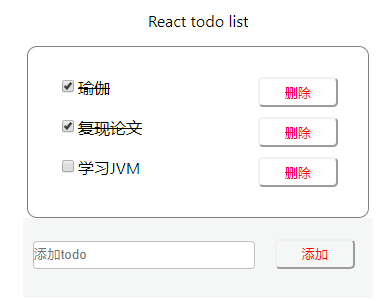

# Todo List(React)

###  成果图如下

#### 以下是题目要求

***

> # Todo list
> 
> "Todo List示例
>
> - 渲染一个todo List
> - 可以添加新的 todo 事项
> - 可以区分已完成和未完成事项
> - 可以将未完成的事项标记为已完成"

### 遇到的困难

* 有些样式用CSS修改过于麻烦且不美，考虑可以用其他框架来解决
* React有些状态修改不太熟练，感觉其实和面向对象的思想特别像
* node_module过大，故不push到github上